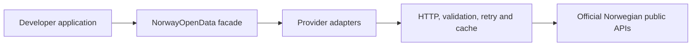

# Norway Open Data SDK

[](https://github.com/iamkm1/Norway-Open-Data/actions/workflows/ci.yml)


[](LICENSE)

One typed TypeScript interface for Norwegian public data.

Norway Open Data SDK provides a consistent, runtime-validated client for official Norwegian APIs
from Brønnøysundregistrene, SSB, Kartverket, Entur, MET Norway, Data.norge, Norges Bank,
Stortinget, Statens vegvesen, NVE and Hva koster strømmen?

- 11 public-data providers
- 14 service namespaces
- 53 public methods
- Runtime-validated responses
- Cross-provider profiles that answer one question from several agencies
- Auto-paginating async iterators for list endpoints
- ESM, CommonJS and TypeScript support
- 230 automated tests, plus 31 live contract checks run weekly
- 94% statement and line coverage

Requests go directly from your Node.js application to the official APIs. The SDK has no hosted
backend, database, account system or scraping layer.

## Installation

Requires Node.js 20 or newer. TypeScript declarations are included.

```bash
npm install norway-open-data-sdk
```

For local installation:

```bash
git clone https://github.com/iamkm1/Norway-Open-Data.git
cd Norway-Open-Data

corepack pnpm install
corepack pnpm build
corepack pnpm pack
```

Install the generated tarball from another project:

```bash
npm install /path/to/Norway-Open-Data/norway-open-data-sdk-0.2.0.tgz
```

## Quick start

```ts
import { NorwayOpenData } from "norway-open-data-sdk";

const norway = new NorwayOpenData({
  applicationName: "my-application",
  contactEmail: "developer@example.no",
});

const company = await norway.companies.get("923609016");
console.log(company.data.name);

const addresses = await norway.addresses.search({
  query: "Haraldsgata 100, Haugesund",
  limit: 1,
});
console.log(addresses.data.items[0]);

const profile = await norway.profiles.company("923609016");
console.log(profile.data.location);
```

Anonymous providers work without configuration. Entur and NVDB require `applicationName`; MET
requires `applicationName` and `contactEmail`; NVE HydAPI requires the caller's own API key.

## Supported providers

| Provider                | Namespace             | Capabilities                                                   | Access                         |
| ----------------------- | --------------------- | -------------------------------------------------------------- | ------------------------------ |
| Brønnøysundregistrene   | `companies`           | Organizations, search and sub-entities                         | Anonymous                      |
| Statistics Norway / SSB | `statistics`          | PxWeb metadata and JSON-stat2 data                             | Anonymous                      |
| Kartverket              | `addresses`, `places` | Addresses, place names and nearby search                       | Anonymous                      |
| Entur                   | `transport`           | Autocomplete, departures and journeys                          | Identification required        |
| MET Norway              | `weather`             | Locationforecast data and current entry                        | Identification + contact email |
| Data.norge              | `catalog`             | Datasets, data services and publishers                         | Anonymous                      |
| Norges Bank             | `currency`            | Exchange rates, policy rate and NOWA                           | Anonymous                      |
| Stortinget              | `parliament`          | Representatives, parties, cases, votes, questions and meetings | Anonymous                      |
| Statens vegvesen / NVDB | `roads`               | Road metadata, objects and network segments                    | Identification required        |
| NVE                     | `energy`, `hazards`   | Energy data, warnings and hydrology                            | Anonymous; API key for HydAPI  |
| Hva koster strømmen?    | `electricity`         | Hourly spot prices for all five bidding zones                  | Anonymous                      |

`profiles` composes several providers into one answer: `company` combines Brønnøysundregistrene
with a Kartverket address match, and `address` combines Kartverket, MET Norway, NVE and NVDB.

See the [complete capability matrix](docs/capabilities.md) for every namespace, method, access
requirement and known limitation.

## Common examples

The following examples use the configured `norway` client from the quick start.

### Company lookup

```ts
const company = await norway.companies.get("923609016");
console.log(company.data.name);
```

### Catalogue search

```ts
const results = await norway.catalog.search({
  query: "public transport",
  type: ["dataset"],
  size: 5,
});
console.log(results.data.items);
```

### Cross-provider company profile

```ts
const profile = await norway.profiles.company("923609016");
console.log(profile.data.location);
```

### Cross-provider address profile

One call answers a location from four providers at once:

```ts
const place = await norway.profiles.address("Haraldsgata 100, Haugesund");

console.log(place.data.address.municipalityName); // Kartverket
console.log(place.data.weather?.temperature); // MET Norway
console.log(place.data.hazards); // NVE warnings for the area
console.log(place.data.roads); // NVDB segments within 250 m
```

Enrichment degrades gracefully: `weather` and `roads` are omitted when the client has no
`applicationName`/`contactEmail`, rather than failing the whole call.

### Electricity spot prices

```ts
const prices = await norway.electricity.getPrices({ area: "NO1" });
console.log(prices.data[0]);

const now = await norway.electricity.getCurrentPrice({ area: "NO5" });
console.log(now.data?.nokPerKwh);
```

### Paging through large result sets

List endpoints expose auto-paginating async iterators that request each page on demand:

```ts
for await (const company of norway.companies.searchAll({ municipalityCode: "1106" })) {
  console.log(company.name);
}
```

Bound the walk with `maxItems` or `maxPages`:

```ts
const iterator = norway.catalog.searchAll({ query: "transport" }, { maxItems: 50 });
```

Available on `companies.searchAll`, `catalog.searchAll`, `parliament.searchCasesAll`,
`roads.searchRoadObjectsAll` and `roads.getRoadNetworkAll`.

### Request cancellation

```ts
const controller = new AbortController();

await norway.weather.forecast(
  {
    latitude: 59.4138,
    longitude: 5.268,
  },
  {
    signal: controller.signal,
  },
);
```

### Raw response access

```ts
const rate = await norway.currency.getExchangeRate(
  {
    from: "EUR",
    to: "NOK",
  },
  {
    includeRaw: true,
  },
);
console.log(rate.raw);
```

## Configuration

```ts
import { NorwayOpenData } from "norway-open-data-sdk";

const nveApiKey = process.env.NVE_HYDAPI_KEY;

const norway = new NorwayOpenData({
  applicationName: "my-company-my-application",
  contactEmail: "developer@example.no",
  timeoutMs: 10_000,
  retries: 2,
  cache: { enabled: true, maxEntries: 250 },
  fetch: globalThis.fetch,
  ...(nveApiKey === undefined ? {} : { credentials: { nve: { apiKey: nveApiKey } } }),
});
```

| Option                   | Default            | Purpose                                              |
| ------------------------ | ------------------ | ---------------------------------------------------- |
| `applicationName`        | None               | Caller identity required by Entur, MET and NVDB      |
| `contactEmail`           | None               | Contact address required by MET                      |
| `timeoutMs`              | `10_000`           | Per-attempt timeout in milliseconds                  |
| `retries`                | `2`                | Retry attempts after the initial request; range 0–10 |
| `fetch`                  | `globalThis.fetch` | Custom Fetch-compatible implementation               |
| `cache.enabled`          | `false`            | Enables the per-client memory cache                  |
| `cache.ttlMs`            | Provider default   | Overrides provider-specific TTLs                     |
| `cache.maxEntries`       | `100`              | Maximum memory-cache entries                         |
| `credentials.nve.apiKey` | None               | Free NVE HydAPI key for stations and observations    |

When required by the selected service, each application must provide its own identity, contact
address and credentials. The SDK contains no shared email, API key or fallback identity. Missing
required values raise `ConfigurationError` before a request is made.

Every provider method accepts optional `signal`, `includeRaw` and `bypassCache` request options.

## Response format

Every successful operation returns `OpenDataResponse<T>`:

```ts
type OpenDataResponse<T> = {
  data: T;
  source: {
    id: string;
    name: string;
    homepage: string;
    documentation: string;
    license?: string;
  };
  retrievedAt: string;
  cached: boolean;
  raw?: unknown;
};
```

`data` is the typed result; `source` identifies the provider; `retrievedAt` is an ISO 8601
timestamp; `cached` reports a memory-cache hit; and `raw` is included only when requested. Raw
payloads remain runtime-validated and may be allowlisted or sanitized.

## Error handling

```ts
import { NorwayOpenData, NotFoundError, OpenDataError, RateLimitError } from "norway-open-data-sdk";

const norway = new NorwayOpenData();

try {
  await norway.companies.get("000000000");
} catch (error) {
  if (error instanceof NotFoundError) {
    console.error("Organization not found");
  } else if (error instanceof RateLimitError) {
    console.error("Retry after seconds:", error.retryAfter);
  } else if (error instanceof OpenDataError) {
    console.error(error.provider, error.statusCode, error.message);
  } else {
    throw error;
  }
}
```

Exported errors are `OpenDataError`, `ConfigurationError`, `InputValidationError`,
`NotFoundError`, `RateLimitError`, `ProviderError`, `RequestTimeoutError` and
`ResponseValidationError`. Retryable provider responses, timeouts and temporary network failures
use bounded retries and honor `Retry-After`; validation and other client errors are not retried.

## Caching

```ts
const norway = new NorwayOpenData({
  cache: { enabled: true, maxEntries: 250 },
});

const first = await norway.companies.get("923609016");
console.log(first.cached); // false

const second = await norway.companies.get("923609016");
console.log(second.cached); // true
```

Caching is disabled by default. When enabled, each client uses a bounded in-memory TTL/LRU cache
with provider-specific TTLs. Failures are never cached, and `{ bypassCache: true }` skips both
reads and writes. See [Architecture](docs/architecture.md) for implementation details.

## Documentation



- The facade creates all service namespaces with one shared configuration and cache.
- Provider adapters own request construction, runtime schemas and safe normalization.
- The shared core handles timeout, cancellation, retries, errors and caching.
- Provider-specific semantics are preserved instead of forced into one universal model.

- [Complete API capabilities](docs/capabilities.md)
- [Examples](docs/examples.md)
- [Architecture](docs/architecture.md)
- [Provider access, licences and attribution](PROVIDERS.md)
- [Adding a provider](docs/adding-a-provider.md)
- [API stability](docs/api-stability.md)
- [Testing](docs/testing.md)
- [Contributing](CONTRIBUTING.md)

Generate the TypeDoc API reference locally with:

```bash
pnpm run docs
```

TypeDoc writes to `docs/api`; open `docs/api/index.html`. The generated reference is not currently
hosted.

## Testing

```bash
pnpm test
pnpm test:coverage
```

Live tests are opt-in and call the official providers:

```bash
NORWAY_OPEN_DATA_APPLICATION_NAME=my-application \
NORWAY_OPEN_DATA_CONTACT_EMAIL=developer@example.no \
pnpm test:live
```

PowerShell:

```powershell
$env:NORWAY_OPEN_DATA_APPLICATION_NAME = "my-application"
$env:NORWAY_OPEN_DATA_CONTACT_EMAIL = "developer@example.no"
pnpm test:live
```

See [Testing](docs/testing.md) for live-test coverage, smoke tests and CI behavior.

## Contributing

Development requires Node.js 20+ and pnpm 10:

```bash
pnpm install
pnpm format:check
pnpm lint
pnpm typecheck
pnpm test:coverage
pnpm build
```

Read [CONTRIBUTING.md](CONTRIBUTING.md) before opening a pull request. User-visible changes require
a Changeset:

```bash
pnpm changeset
```

## Licence

The SDK source code is available under the [MIT Licence](LICENSE). MIT does not automatically apply
to returned data: every provider or dataset retains its own terms, licence, traffic limits and
attribution requirements. Users must follow those terms when using or redistributing data.

**Norway Open Data SDK is an independent open-source project. It is not affiliated with, sponsored
by or endorsed by Norwegian public authorities.**

Personal and restricted data are outside the project scope.

## Known limitations

- The SDK targets Node.js 20+; browser support is not guaranteed.
- Upstream API contracts and response shapes can change independently of the SDK.
- Some providers require caller identification, a contact email or a free API key.
- The optional cache is in-process only and is not shared or persistent.
- Protected endpoints, personal data, write operations and delegated authentication are not
  supported.

See [PROVIDERS.md](PROVIDERS.md) for provider-specific limits, licences and caveats.
